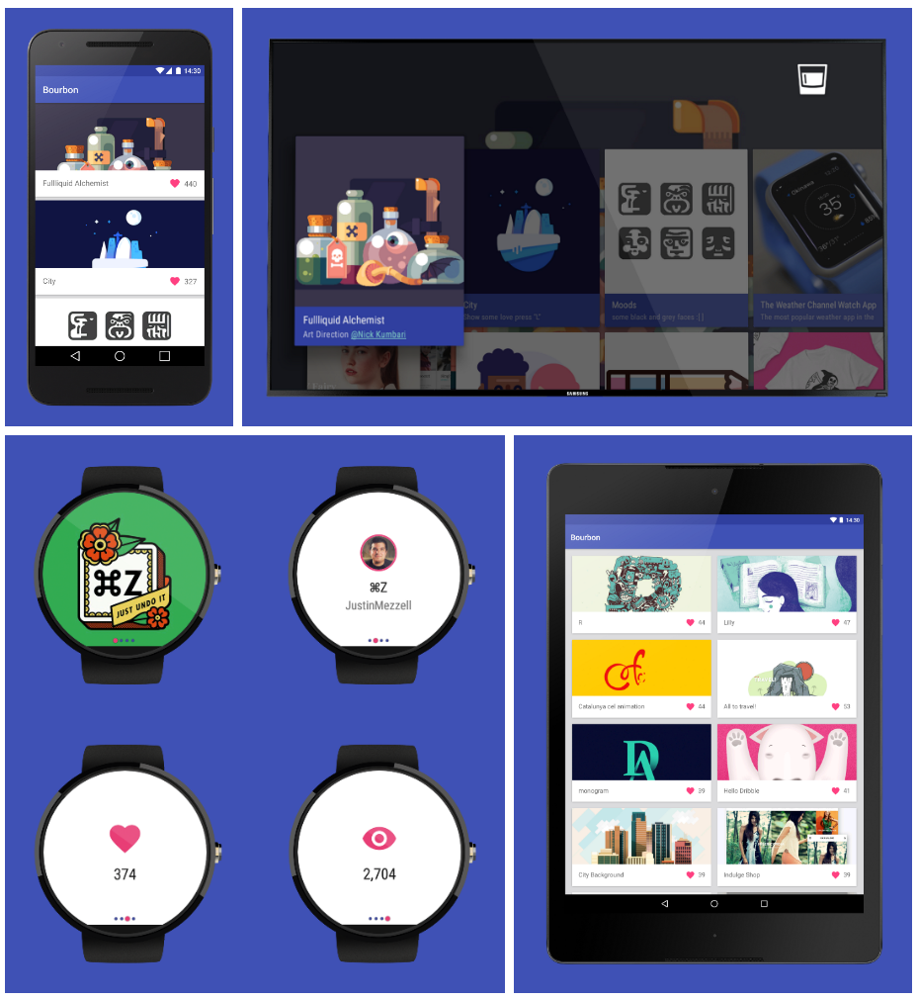
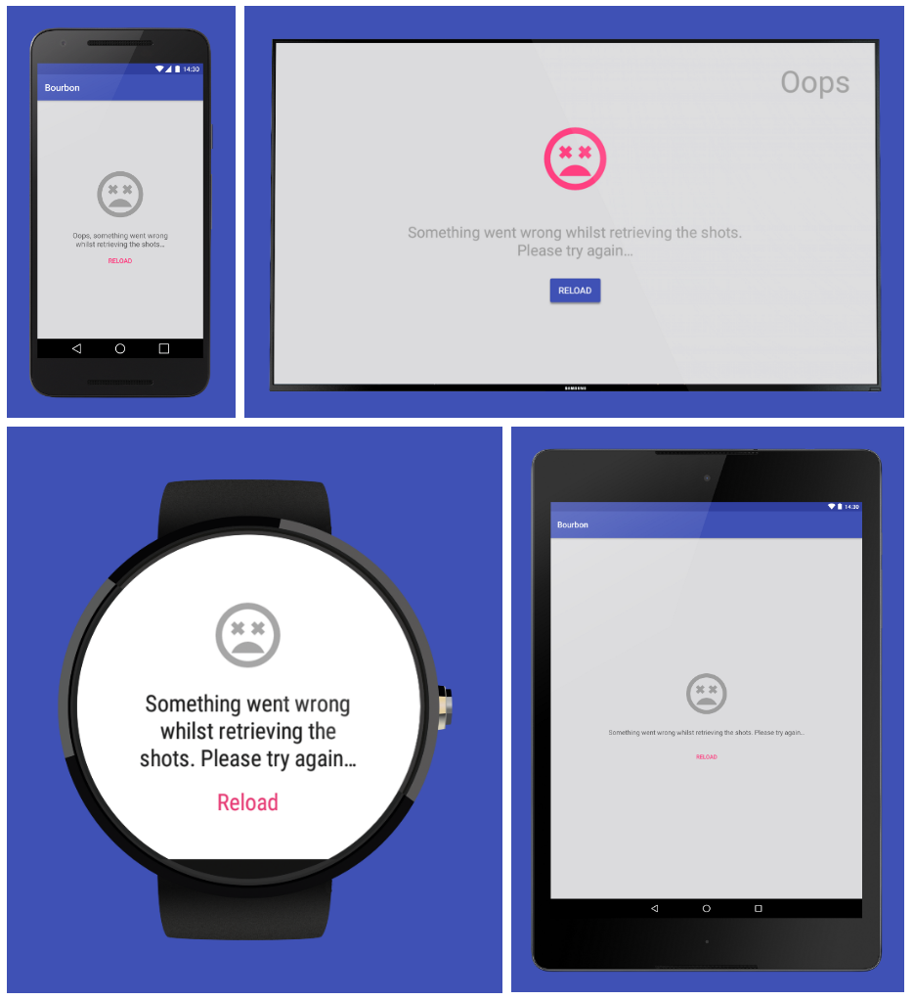
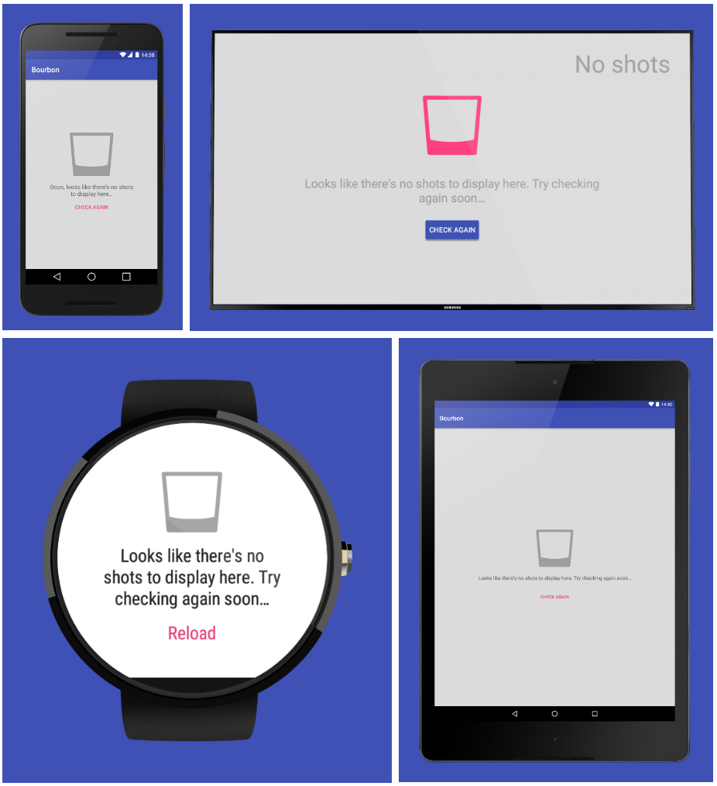
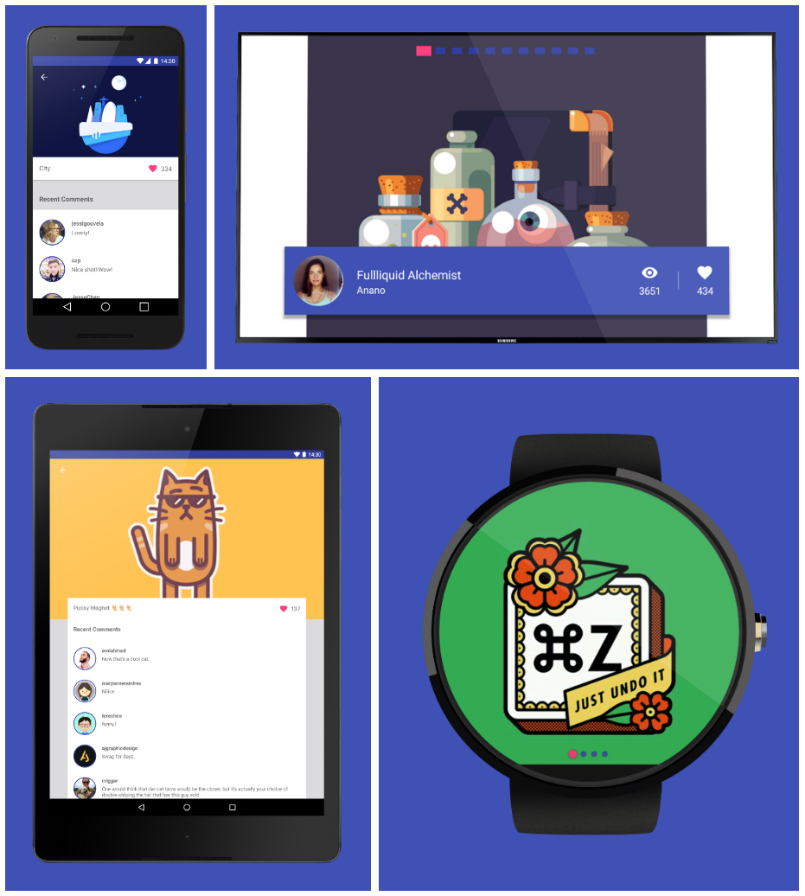
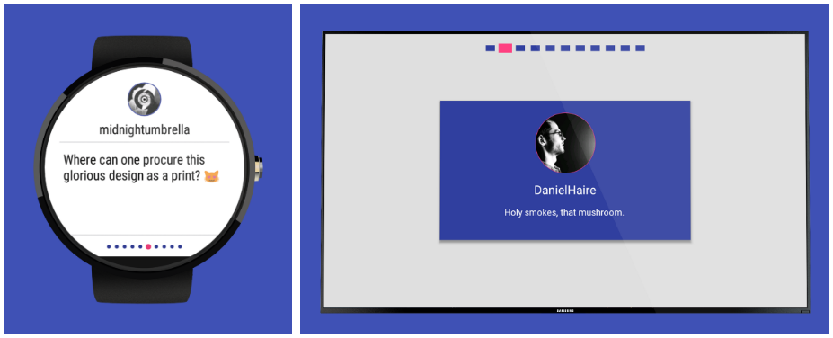

Bourbon
=======
  [![Sidebar] (https://img.shields.io/badge/Sidebar-06%2F05%2F2016-orange.svg)](http://sidebar.io/2016/5/6)

    

    

Bourbon is a simple Dribbble client built for Android Mobile, Wear and TV (it's also optimised for tablets). It was built as an experiment for sharing code through a common-code module when using an MVP architectural approach.

# Structure
----------

Bourbon uses a CoreCommon module to share code amongst the different application packages, you can see from the long list below that this allows us to re-use a lot of the code for our app! The CoreCommon modules contains:

- **BourbonApplication** - This is a standard Android application class that I’ve simply re-used for each of the application modules. This essentially uses Dagger to set up our ApplicationComponent and Timber for logging purposes.

- **Data Models** - Seeing as our application modules are all going to be displaying the same data, it makes sense for them to share the Data Models. There are only 4 (minimal) models used in the application (Shot, User, Comment, Image) but sharing them in this module makes it easier to maintain them if they change at any point.

- **DataManager** - The DataManager class acts as a middle-man for communication with the BourbonService. Again, the application modules all access the same data so sharing the DataManager is just logical.

- **BourbonService** - The BourbonService states the endpoints and manages the retrieval of data from them. So as above with the DataManager, the behaviour is the same across application modules.

- **Dagger Injection Components and Modules** - Seeing as we now know our three application modules use the same DataManager, BourbonService etc - it only makes sense to also share the logic related to Dagger injection. If you look at the injection package, you’ll see that there are several classes declaring components and modules, meaning that the same dependancies can be injected across the applications.

- **Base Presenter and MvpView** - Bourbon uses base classes for Presenters and MvpViews that should be used when created new classes of these kinds. For this purpose, using them through the CoreCommon module ensures that all classes are extending or implementing the same base classes - this again also reduces code duplication.

- **BrowseMvpView & BrowsePresenter** - The Browse screen for each of our application modules behaves in exactly the same way. A list of shots is retrieved and that list if displayed to the user - however, showing / hiding progress indicators, making an API request and correctly displaying with any empty / error states to the user. This means that the Presenter classes will contain the same logic and the MvpView interfaces will define exactly the same interface methods. Fir this reason it makes sense for both the BrowseMvpView & BrowsePresenter to be kept in the CoreCommon module so that these classes only need to be defined once to be shared across our application modules.

- **ShotMvpView & ShotPresenter** - The same applies to the screens used to display Shot Details. The class and interface used to handle the display of content on the screen, so we share the ShotMvpView and ShotPresenter through the CoreCommon module.

- **Colors, String & Dimension files** - Bourbon has specific branding colors, so this isn’t going to change across it’s applications modules. The same also goes for the Strings used throughout the application, there are also some Dimension values that also hold true to this. Because of this, I’ve placed these values in resource files in the CoreCommon module — meaning that they can be shared across the application modules. Now if any of these colors or Strings needs to be changed, I only have to do it once!

- **TestDataFactory** - The TestDataFactory is a class used to construct dummy data models that are used in both the Unit and Instrumentation tests. For this purpose this class exists in the CoreCommon module, which is where the AndroidTestCommon module can access this class from.

- **Unit Tests** - Because the classes requiring unit test are found in the CoreCommon module, the Unit Tests can also be found here. A separate package contains tests for the DataManager and Presenter classes defined in the CoreCommon module.

# Features
---------

You can read more about bourbon here, but here's a quick look at the current features of the application:

Browse Shots
------------

The user can browse the latest 20 shots on their mobile, tablet, wear or TV device:

    

On these screens, we also account for error states:

    

and lets not forget about empty states either:

    

Shot Details & Comments
-----------------------

Upon selecting a shot the user can view a shots image alongside any comments for that shot, as shown below:

    

Comments on Wear and TV are also displayed, just in a different manner due to the nature of the devices:

    

Coming Soon
-----------------------

I wanted to write about and ship this once V1 was finished, but soon I plan on:

- Implementing animations / motion events for transitioning views and screens
- Add user profile screens
- Pagination when browsing shots
- And anything else I think of...

Requirements
------------

 - [Android SDK](http://developer.android.com/sdk/index.html).
 - Android [5.0 (API 21) ](http://developer.android.com/tools/revisions/platforms.html#5.0).
 - Android SDK Tools
 - Android SDK Build tools 23.0.2
 - Android Support Repository
 - Android Support libraries

Building
--------

To build, install and run a debug version, run this from the root of the project:

    ./gradlew app:assembleDebug
    
    
Testing
-------

To run the Unit Test found in the CoreCommon module, run the following command from the root of the project:

	./gradlew corecommon:testDebugUnitTest

As mentioned the the structure section above, each of the instrumentation tests are split into a seperate module. You can run the instrumentation tests for these modules by running the commands below from the root of the project:

To run instrumentation tests for mobile:

	./gradlew mobile-androidTest:connectedAndroidTest

To run instrumentation tests for wear:

	./gradlew wear-androidTest:connectedAndroidTest

To run instrumentation tests for TV:

	./gradlew tv-androidTest:connectedAndroidTest
