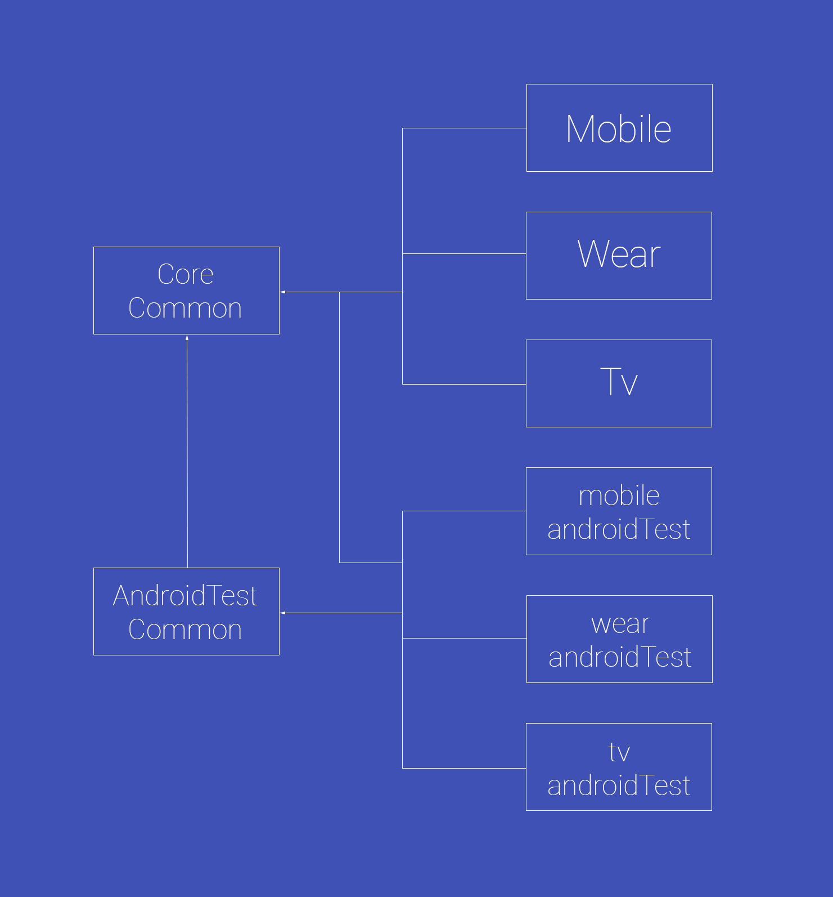
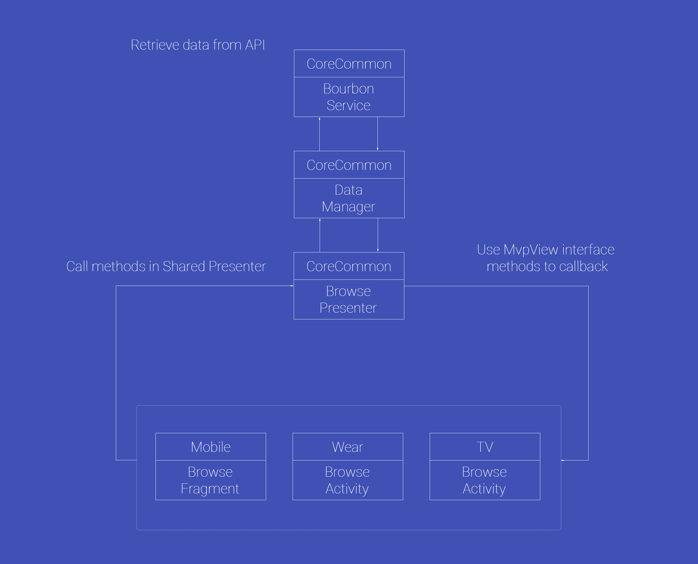

Bourbon
=======

    

Bourbon is a simple Dribbble client built for Android Mobile, Wear and TV (it's also optimised for tablets). It was built as an experiment for sharing code through a common-code module when using an MVP architectural approach.

#Structure
----------

Bourbon uses a CoreCommon module to share code amongst the different application packages, you can see from the long list below that this allows us to re-use a lot of the code for our app! The CoreCommon modules contains:

- BourbonApplication - The Application class for our app, this can be used by all 3 of our application modules.
- Data Models - These define the data models used throughout our application.
- DataManager - Defines the methods used when making calls to the BourbonService class to fetch data from the API.
- BourbonService - Used when retrieving data from the Dribbble API.
- Dagger Injection Components and Modules - Defines the modules and components used for injection throughout the application.
- Base Presenter and MvpView - Defines base classes used by each of the Presenters and MvpViews in the application.
- BrowseMvpView & BrowsePresenter - Defines both the logic and interface methods used by the Browse screens in the application.
- ShotMvpView & ShotPresenter - Defines both the logic and interface methods used by the Detail screens in the application.

- Colors, String & Dimension files - Allows us to share common colors and text used throughout the application.

- TestDataFactory - Used by both the Unit and Instrumentation tests, this allows us to create instances of our data models for use in the tests.
- Unit Tests - Unit tests for the DataManager and Presenters are found here.

The structure of the above looks as like so:

    

As an example of how this is put into practice, take a look at this diagram to demonstrate how the Browse screens retrieve their data:

    

You can see here that the 3 Browse classes from the Mobile, Wear and TV packages all share the same BrowsePresenter, BrowseMvpView, DataManager and BourbonService. Because out 3 Browse classes all have exactly the same implementation, it makes complete sense to share this code where possible. The CoreCommon module allows us to share these classes, as well as the Data Models and the Unit Tests for the Presenter & Data classes.

#Features
---------

You can read more about bourbon here, but here's a quick look at the current features of the application:

Browse Shots
------------

The user can browse the latest 20 shots on their mobile, tablet, wear or TV device:

    

On these screens, we also account for error states:

    

and lets not forget about empty states either:

    

Shot Details & Comments
-----------------------

Upon selecting a shot the user can view a shots image alongside any comments for that shot, as shown below:

    

Comments on Wear and TV are also displayed, just in a different manner due to the nature of the devices:

    

Coming Soon
-----------------------

I wanted to write about and ship this once V1 was finished, but soon I plan on:

- Implementing animations / motion events for transitioning views and screens
- Add user profile screens
- Pagination when browsing shots
- And anything else I think of...

Requirements
------------

 - [Android SDK](http://developer.android.com/sdk/index.html).
 - Android [5.0 (API 21) ](http://developer.android.com/tools/revisions/platforms.html#5.0).
 - Android SDK Tools
 - Android SDK Build tools 23.0.2
 - Android Support Repository
 - Android Support libraries

Building
--------

To build, install and run a debug version, run this from the root of the project:

    ./gradlew app:assembleDebug
    
    
Testing
-------

To run the Unit Test found in the CoreCommon module, run the following command from the root of the project:

	./gradlew corecommon:testDebugUnitTest

As mentioned the the structure section above, each of the instrumentation tests are split into a seperate module. You can run the instrumentation tests for these modules by running the commands below from the root of the project:

To run instrumentation tests for mobile:

	./gradlew mobile-androidTest:connectedAndroidTest

To run instrumentation tests for wear:

	./gradlew wear-androidTest:connectedAndroidTest

To run instrumentation tests for TV:

	./gradlew tv-androidTest:connectedAndroidTest
